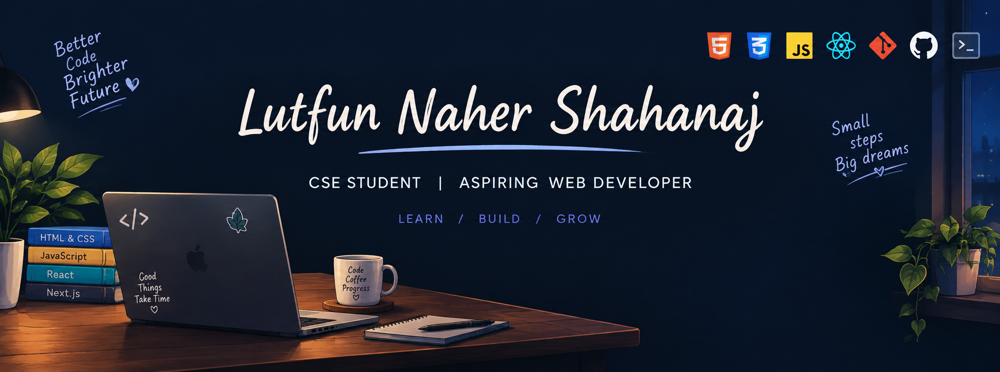

  

<h1 align="center">Hi 👋, I'm Lutfun Naher Shahanaj</h1>

<h3 align="center">CSE Student | Aspiring Web Developer</h3>

---

## 👩‍💻 About Me

I'm a Computer Science and Engineering student with a growing interest in web development. I enjoy building responsive and user-friendly websites and learning modern web technologies through practical projects.

I'm currently focused on strengthening my skills in JavaScript, React, TypeScript, and Tailwind CSS while continuously improving my problem-solving and development skills.

### 🚀 Currently

- 🌱 Exploring **Next.js** and modern web development
- 💻 Building projects with **React, TypeScript, and Tailwind CSS**
- 📚 Strengthening my **JavaScript and problem-solving skills**
- 🔨 Working on practical web-development projects
- 🎯 Preparing for future **web-development internships**

---

## 🛠️ Skills

  

---

## 🌐 Connect With Me

  
  

---

## 📊 GitHub Stats

  
  

  

